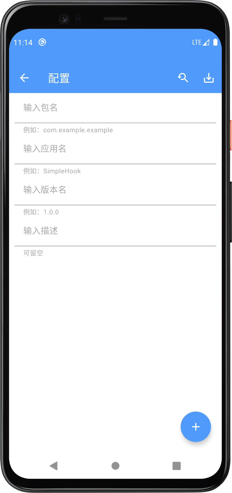

#SimpleHookShare

# Here is the SimpleHook hook part of the code

# simpleHook instructions

English|[中文文档](README.md)

> Time is limited, the following description uses Google Translate

> [simpleHook.apk](https://wwp.lanzoub.com/b0177tlri)(password: simple)

> tg:@simpleHook

> This software is mainly simple, just like the name. If you pursue more complex hook operation, it is recommended to use [JShook] (frida), [曲境] (computer browser operation); if you pursue more extended functions, it is recommended to use [算法助手]

> Function overview: custom return value, parameter value, etc., record common encryption algorithms, toast, dialog, popupwindow, JSONObject creation and increase, etc.

> Development plan:
>
> Due to busy schoolwork, new functions cannot be added temporarily
>
> In the future, SimpleHookPlus will be developed (one year later), which can solve the problem that most applications need to refill the class name and method name due to the change of class name and method name across versions.

## 1. Function description

### Page Introduction

**front page**


Click the plus sign to add configuration, click Add configuration to enter the following page

**Configuration page**



Click the 'Search Style' icon to enter the AppList page and select an application

Click the 'Download Style' icon to save the configuration

Click the plus sign in the lower right corner to fill in the configuration in the pop-up window


There are multiple modes to choose from. Before entering the class name, it is recommended to understand the settings page (smali to config), which can simplify filling.

**Extended page**


**Specific function**


Click the "Play Style" button to open the floating window (you need to grant the permission of the floating window), and then open the target application, you can display some information (the printing parameter value, return value, and most functions of the extended page are turned on)

Floating window


## Custom Hook writing rules

The following is the writing rule: (You can download *[HookTest.apk](https://littlewhiteduck.lanzoui.com/b0eqxvvbc)(password: simple)*, this App applies all the situations and includes configuration)

> Please understand the setting page smali to config before use, it can simplify your operation (with reverse analysis software such as MT manager)

### A brief basic introduction

- Support Java syntax and Smali syntax to fill in configuration information

  ````java
  // java
  me.simplehook.MainActivty
  // smali
  Lme/simplehook/MainActivity; //must have --> ; <--
  ````
- Support for primitive types and other type parameters

  ````java
  // Type is mainly used to fill in the parameter type and variable type
  // caution! ! ! Arrays are not currently supported, such as: int[]
  // Basic types you can fill in using java syntax like this
  boolean int long short char byte float double
  // You can also use smali syntax to fill in basic types like this
  Z I J S C B F D
  // For other types, you can use java syntax to fill in
  jave.lang.String android.content.Context
  // You can also use smali syntax to fill in other types like this
  Ljava/lang/String; Landroid/content/Context; //must have --> ; <--
  ````
- Filling rules for result values

  > It should be noted here that this software does not need to fill in the return value and parameter value type like other software, this software does not need it, you only need to fill in according to the rules, and automatically judge
  > If you want to add common types, you can email me, if it is common, I will add it in subsequent versions
  >

  ````java
  boolean, Z: true, false
  int, I: 1, 2, 3
  long, J: 1l, 120000L, 123456l //Be careful to add l/L after the number
  short, S: 1short, 2short //Pay attention to the number with short after
  char, C: 195c  // The char type is followed by c
  byte, B: 2b, 3b // Follow the byte type with b
  float, F: 2f, 3f //Pay attention to the number followed by f
  double, D: 2d, 3d //Pay attention to the d after the number
  Other types (can only return null (except strings)): null
  String(java.lang.String): does not conform to the above all converted to string type
  	Other situations:
    Numbers: 111s, 2002s followed by s // common in "111111", but in this software, you need to add s after the number, if you don't add s, it will be converted to a number, which may cause the target application to crash
    Boolean: trues, falses // Common in "true" and "false", but in this software, you need to add s after the boolean value. If you don't add s, it will be converted to a boolean value, which may cause the target application to crash
    null: nulls // Common in "null", but you need to add s after null in this software. If you don't add s, it will be converted to null, which may lead to a null pointer in the target application
  ````

### Specific hook mode

#### hook return value

````java
/*
  eg 1
  import simple.example;
  Class Example{
    public static boolean isFun() {
      boolean result = true;
      ...
       ...
      return result
    }
  }
  Mode selection Hook return value
  The class name should be filled in: simple.example.Example
  The method name should be filled in: isFun
  The parameter type should be filled in: (leave blank here because there are no parameters)
  The modified value should be filled in: true or false
*/
/*
Filling method of multiple parameter parameter types (separated by English commas, parameter types support arrays):
boolean, int, android.content.Context


eg 1
  import simple.example;
  class Example{
    public static String isFun(Sring str, Context context, boolean b) {
      String result = str;
      ...
       ...
      return result
    }
  }
  Mode selection Hook return value
  The class name should be filled in: simple.example.Example
  The method name should be filled in: isFun
  Parameter type should be filled in:
    java syntax: java.lang.String,android.content.Context,boolean (use commas to separate the parameters, only one parameter does not need a comma)
    smali syntax: Ljava/lang/String;,Landroid/content/Context;,Z
  The modified value should be filled: it is a string (should meet the filling rules of the result value, no quotation marks are required)
*/
````

#### hook parameter value

````java
// The type value is the same as the hook return value type
//Special usage, such as the following code
public boolean isModuleLive(Context context, String str, int level){
  
    retrun true
}
//If you only want the value of the hook level, you can fill in the following in the column to modify the value
,,99
//If you only want the value of hook str, you can fill in the following in the column to modify the value
, la la la,
//If you only want the value of hook str and level, you can fill in the following in the column to modify the value
, la la la, 99
//If you want all hooks, you can fill in the following in the modified value column
null, la la la, 99 // context being null may cause a crash
/*
Filling method of multiple parameter parameter types (separated by English commas):
android.content.Context,jave.lang.String,int
Or fill in as follows
Landroid/content/Context;,Ljave/lang/String;int
*/
````

#### interrupt execution

````java
// This mode will intercept method execution
// Fill in the same as the hook return value or hook parameter value, do not need to fill in the return value and parameter value
public void printString() {
    System.out.println("start");
    testBreakMethod();
    System.out.println("end");

    /*
      The output is
      start
      end

      "test Break Mode" is not output
    */
}

// if: this method is interrupted
public void testBreakMethod() {
    System.out.println("test Break Mode")
}
````

#### static variables

````java
import simple.example;
public class Example{
  public static boolean isTest = false;
}
// Concrete values only support primitive types, and strings
// There is no need to fill in the variable type; it must comply with the rules for filling in the result value
/*
  Mode selection Hook static variable
  The class name should be filled in: simple.example.Example
  The variable name should be filled in: isTest
  Variable type does not need to be filled in
  The modified value should be filled in: true/false
*/
````

#### variables

> Fill in the same as static variables

#### print parameter value

> The parameter values of the method will be recorded, go to the record page to view,
> If the parameter is an array or list, it will be converted to json format

#### print return value

> The return value of the method will be recorded, go to the record page to view
> If the result is an array or list, it will be converted to json format

#### print parameters

> The parameter value and return value of the method will be recorded together, go to the record page to view
> If the result is an array or list, it will be converted to json format
> If the parameter is an array or list, it will be converted to json format

## Extend Hook

> Remember to turn on the main switch
> Please go to the app to view the functions

## Frequently Asked Questions (FAQ)

### 1.hook has no effect

> You may not have Turn on storage permission to write configuration (top of settings page)
>
> If it is not enabled, it will only read data from the database, but there is a problem, https://medium.com/androiddevelopers/package-visibility-in-android-11-cc857f221cd9
>
> Turn on storage permission to write configuration, still no effect:
>
> You can view the framework log. If it prompts that the storage file has no storage file configuration, make sure to enable the write storage configuration
>
> In addition, in some cases, the storage file update configuration needs to be refreshed manually. It can be refreshed by opening, closing, editing and saving.
>
> You also need to manually refresh the configuration to switch between the ROOT version and the normal version (generally only needed for extended configuration)
>
> After uninstalling and reinstalling the target application, it is generally necessary to manually refresh the configuration (generally only required for extended configuration)

### 2. What is smali transfer configuration

```smali
  After this experimental function is enabled, a 'pasteboard' icon will be added to the top of the configuration page. Click to convert the application code or signature into a configuration (to prevent manual input errors). After adding the configuration, you need to manually select the appropriate mode and result value.
  Example of calling code:
   iget v0, p0, Lme/duck/hooktest/bean/UseBean;->level:I
   invoke-virtual {v0}, Lme/duck/hooktest/bean/UseBean;->isHook()Z
  Method signature, field signature example:
   Lme/duck/hooktest/bean/UseBean;->level:I
   Lme/duck/hooktest/bean/UseBean;->isHook()Z
   The above can be selected by long-pressing a field or method in the MT Manager navigation to select Copy Signature or Find Call
```

### What is the difference between 3.root version and normal version

> There is no difference in function between the two, only the difference in writing to the local configuration directory
>
> The root configuration storage directory is:
>
> /data/simpleHook/target application package name/config/
>
> hook.json is the custom hook configuration, assist.json is the extension function configuration
>
> /storage/emluated/0/Android/data/target application package name/simpleHook/config/
>
> hook.json is the custom hook configuration, assist.json is the extension function configuration
>
> The normal version configuration storage directory is:
>
> /storage/emluated/0/Android/data/target application package name/simpleHook/config/
>
> hook.json is the custom hook configuration, assist.json is the extension function configuration
>
> How to choose, first use the normal version, if the normal version cannot be used, then use the root version, two versions may have one version that does not work on different models

### 4. Some records cannot be recorded normally

> You may not have Turn on storage permission to write configuration (top of settings page)
>
> Remember to manually refresh the configuration after opening (re-save or switch the configuration)

### 5. The software needs to hang in the background before it can be used

> You may not have turned on Enable storage permissions to write to configuration (switch configuration settings at the top of the page)
>
> Remember to manually refresh the configuration after opening (re-save or switch the configuration)
